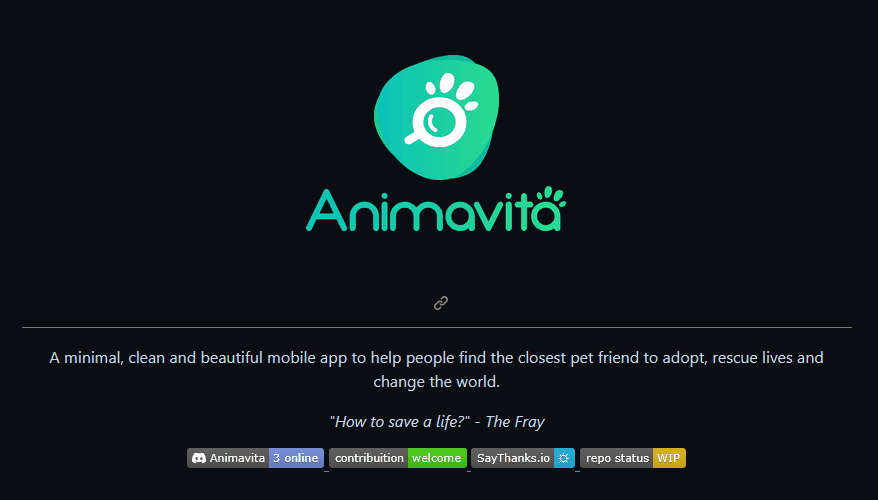

# Projeto com README
Um projeto de teste com um arquivo README 😊

[](https://google.com)

## Tecnologias Utilizadas

- HTML
- CSS
- JS

## Como Utilizar

1 - Clone o projeto
```
git clone <url>
```

2 - Acesse pasta do projeto
```
cd repositorio-com-readme
```